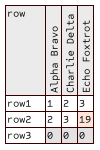

# rendercsv

Command line tool to quicky get picture from CSV file, manually specifyig cell dimensions. Main use case is to create create animated tables from a series of CSV files (obtained e.g. using `qsv partition --drop`).

## Features

* Rotating specific cells (to economize horizontal space in header row)
* Setting colour of specific cells (to emulate conditional formatting)

## Limitations

* Table geometry is not calculated. You need to specify a number of command line parameters for the table to looks OK.
* Text alignment is fixed.
* Default font is lean. Specify custom font to render more text.

## Cell text prefixes

Text in a cell is parsed for the following prefixes:

* `rot:` - rotate this cell
* `l=N:` - set cell background colour lightness to N
* `s=N:` - set cell background colour saturation to N
* `h=N:` - set cell background colour hue to N

## Example

```
$ cat test.csv
row,rot:Alpha Bravo,rot:Charlie Delta,rot:Echo Foxtrot
row1,1,2,3
row2,2,3,h=30:s=40:19
row3,l=90:0,l=90:0,l=90:0

$ rendercsv test.csv test2.png --first-column-width 40 --column-width 16 --first-row-height 90 -W 100 -H 150
```



## Installation

Download a pre-built executable from [Github releases](https://github.com/vi/rendercsv/releases) or install from source code with `cargo install --path .`  or `cargo install rendercsv`.

## CLI options

<details><summary> rendercsv --help output</summary>

```
Usage: rendercsv [OPTIONS] <INPUT_CSV> <OUTPUT_PNG>

Arguments:
  <INPUT_CSV>   
  <OUTPUT_PNG>  

Options:
  -W, --width <WIDTH>
          [default: 1280]
  -H, --height <HEIGHT>
          [default: 720]
      --font <FONT>
          font file (ttf) to render legend text. Default is embedded font Dharma Type Sometype Mono
  -s, --font-scale <FONT_SCALE>
          Text size [default: 12.0]
  -Y, --first-row-height <FIRST_ROW_HEIGHT>
          [default: 60]
  -y, --row-height <ROW_HEIGHT>
          [default: 16]
  -X, --first-column-width <FIRST_COLUMN_WIDTH>
          [default: 80]
  -x, --column-width <COLUMN_WIDTH>
          [default: 60]
  -h, --help
          Print help
```
</details>
